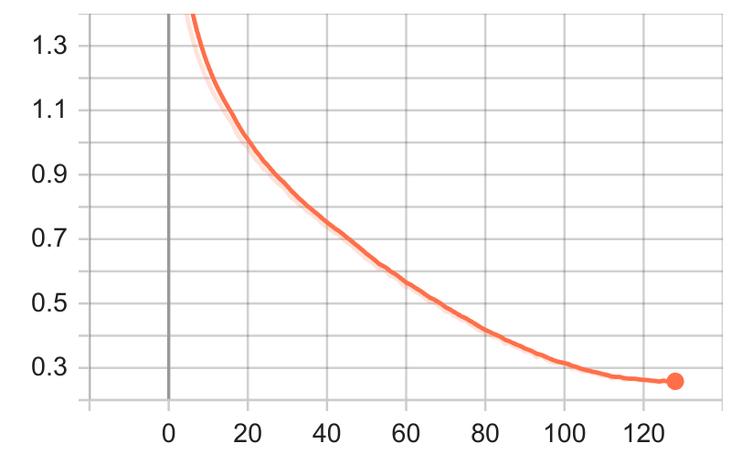
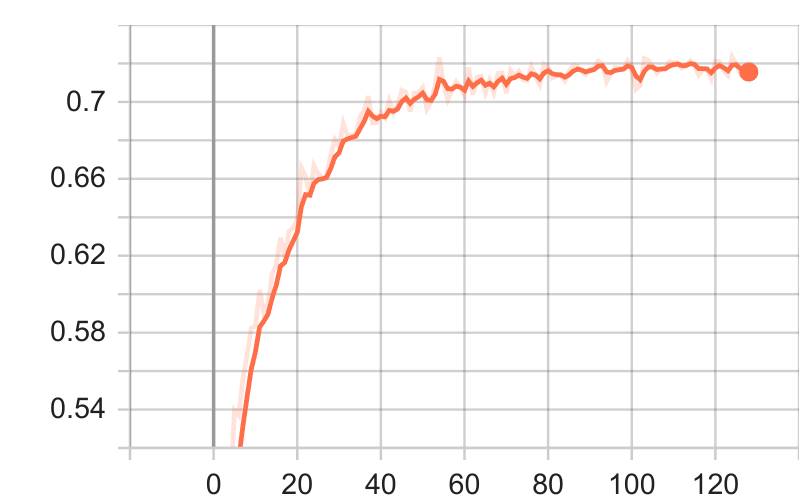

## Vision Transformer implementation in pytorch and training on CIFAR10

Algorithm:  
Dosovitskiy et al. (2020). An image is worth 16x16 words: Transformers for image recognition at scale.   
[_arXiv:2010.11929_](https://arxiv.org/abs/2010.11929)

To start training run
```
python train.py <model-name>
```
```train.py``` takes one positional argument. For possible keyword arguments see ```train.py``` code.

Pretrained model is stored in _models/vit-cifar1/vit-cifar1.pth_  
Test accuracy is ~0.71

&nbsp;

Optimizer: [AdamW](https://pytorch.org/docs/stable/generated/torch.optim.AdamW.html)  
Learning rate scheduler: [CosineAnnealingLR](https://pytorch.org/docs/stable/generated/torch.optim.lr_scheduler.CosineAnnealingLR.html)  
Epochs: 150  
Batch_size: 128  
Data augmentation: random horizontal flip, random crop/resize  
Dropout: 0.2

Hyperparameters [models/vit-cifar1/hparams.json](models/vit-cifar1/hparams.json).  
Tensorboard [log](https://tensorboard.dev/experiment/y1RbK6PXRx2NCmz6DZwZow/).

Training loss            |  Validation accuracy
:-------------------------:|:-------------------------:
 |  


&nbsp;

Repos used:  
https://github.com/google-research/vision_transformer  
https://github.com/rwightman/pytorch-image-models  
https://github.com/FrancescoSaverioZuppichini/ViT
